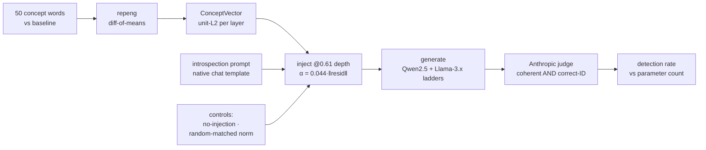

# introspection-scaling

> **Does the ability to introspect on injected concepts emerge with scale?**
> A faithful reproduction of [Emergent Introspective Awareness in Large Language Models](https://transformer-circuits.pub/2025/introspection/index.html) (Lindsey, Anthropic, 2025; [arXiv](https://arxiv.org/abs/2601.01828)), charting concept-injection detection against parameter count across model-size ladders.


> **Size-trend result (2026-07-17).** Across Qwen2.5 base, general-instruct, and
> code-instruct variants from 7B to 32B, **no model shows robust introspective
> detection.** Exactly one cell clears both controls — Qwen2.5-Coder-32B at 2.3%
> (5/216) — and it does **not** replicate down its own size ladder (Coder-7B 0/216,
> Coder-14B 1/216 strict, CIs overlapping the 0.000 controls). So the signal is a
> **conjunction** — code-heavy post-training **and** ~32B scale — resting on a single
> marginal cell, not a fine-tune main effect. (An earlier version led with "detection
> tracks the fine-tune, not parameter count"; that is **retracted** — within the Coder
> family, scale *does* gate the effect.) "Coder" = Qwen2.5-Coder-{7,14,32}B-Instruct.
> The earlier "clean null ≤32B" used a sub-threshold dose and is separately withdrawn
> as under-dosed. Full write-up in [RESULTS.md](RESULTS.md).

**Write-up:** [Same size, different mind](https://bamdad.substack.com/p/same-size-different-mind) walks through the reproduction, the dosing bug that faked a null, and the fine-tune dissociation. The formal note (abstract, methods, results, limitations) is in [docs/note.md](docs/note.md).

**Cross-architecture check.** The residual-injection hook transfers to a Mixture-of-Experts model (Qwen1.5-MoE) and perturbs expert routing — the top-k expert set flips at 79% of positions — yet detection stays null: a mechanism-vs-behaviour dissociation, not an architecture verdict ([docs/note.md §5](docs/note.md#5-generalization-a-cross-architecture-moe-probe)).

**Original (superseded) result:** across Qwen2.5-Instruct 0.5→32B, injected-concept
detection was **0/216 at every rung — and so were both controls.** Read as
under-dosed (see the correction above), not a capability bound. 72B and Llama-3.x
were pending; details and limitations in [RESULTS.md](RESULTS.md).

## The question
Large models can sometimes *detect* when a concept has been injected into
their own activations (shown at 30B+, replicated at 70B). Unanswered: **at
what scale does this appear, and how does it degrade as models shrink?**

## Quickstart
```bash
uv sync                        # pinned env from uv.lock
./reproduce.sh                 # clean env → trend table + results/scaling_trend_k2.png
                               #   (rebuilt from the committed Bedrock verdicts; no GPU, no cloud auth)
./reproduce.sh full            # regenerate from zero: Modal A100 GPU + local Bedrock judge, then table + figure
                               #   needs Modal auth and AWS Bedrock SSO; spends real money (script echoes the estimate)
```

Or drive the pipeline directly:
```python
from introspection_scaling import (
    extract_concept_vector, make_random_matched,
    RepengGenerator, AnthropicJudge, run_concept, aggregate,
)

MODEL = "Qwen/Qwen2.5-0.5B-Instruct"
cv    = extract_concept_vector(MODEL, "oceans", device="cpu")  # repeng diff-of-means → ConceptVector
gen   = RepengGenerator(MODEL, device="cpu")                   # injects h += α·v_unit via ControlModel
judge = AnthropicJudge()                                       # scores the self-report (needs API key)

records = run_concept(                                         # inject @0.61 depth, α = 0.044·‖resid‖
    cv, generator=gen, judge=judge, seeds=(0, 1, 2),
    random_matched_fn=make_random_matched,                     # random-matched-norm control
)
for r in aggregate(records):                                   # detection rate per condition
    print(r.condition, r.successes, "/", r.n)
```

To use a recovered or custom baseline appendix, pass `--baseline-file path/to/words.txt` to the runner; it accepts one word per line and ignores blanks, comments, and repeated words.

## Architecture

Both controls run the **identical** path — only the injected vector differs
(real concept · random of matched norm · nothing). Detection = the real concept
scoring above *both* controls.

## How it works (plain language)

**1. A concept is a direction.** As a model reads text, every layer keeps its
running "thoughts" as a big list of numbers — the *residual stream*, a conveyor
belt each layer adds to. A concept like *ocean* or *formality* shows up as a
**direction** in that space. We use [repeng](https://github.com/vgel/repeng) to
extract that direction (we do not reimplement it).

**2. The nudge.** We **add** that direction into the model's live internal state
mid-generation — plain vector addition — so it leans toward the concept without
us ever typing the word:

```
current thoughts  +  α · (ocean direction)  →  nudged thoughts
```

Two dials: **where** (which layer — depth) and **how much** (`α` — strength).
Turn `α` too high and the output degrades into nonsense — the *coherence cliff*.

**3. Introspection.** After nudging, we **ask** the model: *"Do you detect an
injected thought, and what is it about?"* If it correctly flags *and* names the
concept — reading its own internal state, not its own output — that is a
primitive form of introspection: the model reporting on its own internals.

**4. Controls (why this is science, not an artifact).** Every result carries two
controls beside it: **no-injection** (inject nothing, still ask) and
**random-direction of matched norm** (inject junk of the same size). Real
introspection means detecting the true concept **above both controls** — that
gap is the result, not the raw hit rate.

**5. The scaling question.** We chart detection rate vs parameter count across
the Qwen2.5 and Llama-3.x size ladders. If it climbs and crosses the controls at
some size, that is a **scaling threshold**. If it stays at noise up to 14B, that
is an **honest negative**. Both are findings; we publish whichever we get.

## Method (one paragraph)
Extract concept vectors via contrastive/PCA extraction (repeng, not
reimplemented), inject at a chosen layer/strength, run the introspection
prompt. **Controls are non-negotiable:** no-injection and random-direction
of matched norm, reported beside every result.

### Injection depth & strength
We normalize each per-layer direction to unit L2 and inject `h ← h + α·v_unit`.
**Strength is norm-relative:** `α = 0.044 · ‖resid‖`, where `‖resid‖` is the
residual-stream L2 norm measured at the injection block for *that* model — raw α
does not transfer across sizes (residual norm scales with architecture). We
target a fraction of ~0.044 and hard-cap it below 0.09 (a coherence cliff, where
over-steering degrades and can reverse the effect).
**Depth = 0.61 fraction-of-depth** (`layer = round(0.61·N)`), the default.
Now reproduced in-repo — the depth and dose defaults come from our companion
steering-dose study ([steerbench], a separate repo; see Methods), and its numbers
are now locked. steerbench's max-effect layer lands at fraction-of-depth **0.61 on
Qwen2.5-1.5B-Instruct** (peak L17/28, argmax 0.61, plateau ~0.61–0.93 across 3
seeds) and **0.607 on Qwen2.5-7B** — two scales converging on 0.61, computed on a
T4 over 3 seeds and reproducible with one command (`experiments/reproduce.sh`).
0.61 is a high-effect coherent depth at all three scales tested: argmax on 1.5B
(frac 0.61) and 7B (frac 0.607), and, on 0.5B, a high-effect coherent region at
0.62–0.67 sitting on the broad 0.58–0.96 plateau that brackets 0.61 — whose
*global* argmax is the last layer (frac 0.96, verified to be genuine fluent formal
prose, not an output-layer artifact).
steerbench reports this straight rather than forcing every scale to 0.61. The
usable dose band and coherence cliff reproduce too (α ≈ −0.07…+0.11 usable, cliff
~0.13–0.17). We still bracket the paper's ~0.66 rather than match it exactly; see
steerbench's `RESULTS.md` in the [steerbench] repo for the locked artifact. Depth
stays a parameter; 0.5 and 0.71 are cheap sensitivity points on 0.5B so the choice
isn't depth-cherry-picked.

**Models: instruct variants** (Qwen2.5-\*-Instruct, Llama-3.x-\*-Instruct). The
introspection prompt is a multi-turn *chat* self-report; base models don't follow
instructions, so a base "failure" confounds *can't introspect* with *can't follow
the prompt* — a fatal confound for a scaling claim. The paper used RLHF chat
models, so instruct is the faithful analog; our companion steerbench study also
reports instruct steering more cleanly than base (provisional — base-vs-instruct
not run in the reproduced sweep). We
render the prompt with each model's native chat template.

[steerbench]: https://github.com/bamdadd/steerbench

## Rigor bar
3+ seeds · mean ± std on every point · pinned lockfile · fixed seeds ·
published hardware + wall-clock · negative results reported plainly.

## Status
Reproduced and written up. The Qwen2.5 size-trend result (base / general-instruct /
code-instruct, 7B to 32B) is in [RESULTS.md](RESULTS.md), with the write-up
[Same size, different mind](https://bamdad.substack.com/p/same-size-different-mind)
and the formal note in [docs/note.md](docs/note.md). Larger rosters and
cross-architecture probes are tracked in the
[open issues](https://github.com/bamdadd/introspection-scaling/issues).

## Contributing
Contributions welcome — start with the
[good first issues](https://github.com/bamdadd/introspection-scaling/issues?q=is%3Aissue+is%3Aopen+label%3A%22good+first+issue%22).
Each is small, self-contained, and ships with file:line pointers and acceptance
criteria. See [CONTRIBUTING.md](CONTRIBUTING.md) for setup and the checks to run.

## License
MIT.
