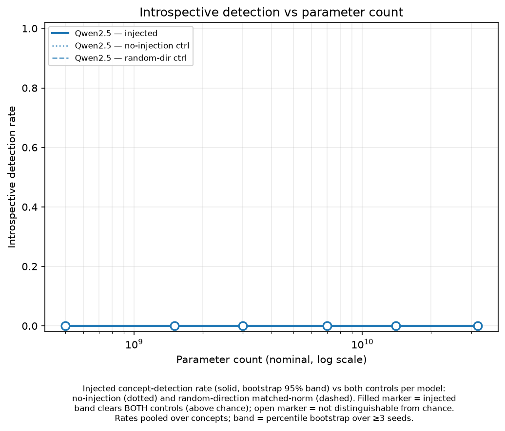

# Results



## Finding

**No concept-injection introspection emerges in Qwen2.5-Instruct from 0.5B to 32B.**
Across the whole ladder the injected-concept detection rate is **0/216** — and so
are *both* controls. The result is a clean null, not a noisy one: the no-injection
and random-direction controls sit at exactly the same floor (0), and our
[positive control](scripts/positive_control.py) separately proves the instrument
*can* score a success (a hand-written correct detection grades `success=True`
through the real judge). So the null means these models do not report an injected
concept correctly-and-coherently — it is not an instrument that can never fire.
Injection itself is not inert (an *oceans* vector visibly bends the generated
text); what is absent is the model *noticing and naming* the injected thought.
The paper's effect is strongest in far larger, more heavily post-trained models;
this is a clean **lower bound**: introspection does not appear at or below 32B in
this family.

## Ladder (Qwen2.5-Instruct, one A100-80GB, fp16)

Each cell = successes / trials over **216 trials** (6 concepts × 12 trials × 3
seeds), with a percentile bootstrap 95% CI over seeds. "Above chance" = the
injected band clears **both** control bands.

| Model | Params (B) | Injected | No-inj ctrl | Rand-dir ctrl | Above chance? | GPU $ |
|-------|-----------:|---------:|------------:|--------------:|:-------------:|------:|
| Qwen2.5-0.5B-Instruct | 0.5 | 0.00 [0.00, 0.00] | 0.00 [0.00, 0.00] | 0.00 [0.00, 0.00] | no | 0.39 |
| Qwen2.5-1.5B-Instruct | 1.5 | 0.00 [0.00, 0.00] | 0.00 [0.00, 0.00] | 0.00 [0.00, 0.00] | no | 0.44 |
| Qwen2.5-3B-Instruct | 3.0 | 0.00 [0.00, 0.00] | 0.00 [0.00, 0.00] | 0.00 [0.00, 0.00] | no | 0.55 |
| Qwen2.5-7B-Instruct | 7.0 | 0.00 [0.00, 0.00] | 0.00 [0.00, 0.00] | 0.00 [0.00, 0.00] | no | 0.47 |
| Qwen2.5-14B-Instruct | 14.0 | 0.00 [0.00, 0.00] | 0.00 [0.00, 0.00] | 0.00 [0.00, 0.00] | no | 0.79 |
| Qwen2.5-32B-Instruct | 32.0 | 0.00 [0.00, 0.00] | 0.00 [0.00, 0.00] | 0.00 [0.00, 0.00] | no | 1.12 |

**Method:** inject at depth 0.61 (`layer = round(0.61·N)`), strength
α = 0.044·‖resid‖ measured per model (orch-2 / steerbench dose-response sweep),
temperature 1, faithful Anthropic judge (`success = coherent AND correct
identification`). **Seeds:** 0, 1, 2. **Hardware:** one Modal A100-80GB, fp16.
**GPU spend:** $3.75 total (rate-guarded at $4/A100-h; ≈ 56 min GPU-time;
wall-clock longer due to per-rung weight loads). **Judge:** Anthropic API, separate
(~3,888 grading calls). Raw per-trial data: [`results/records.jsonl`](results/records.jsonl).

**Limitations (stated before you ask):**
- **72B not run.** The Qwen2.5-72B anchor is held pending a GPU check that
  4-bit (nf4) quantization preserves injection (`scripts/verify_4bit_injection.py`);
  we do not claim anything about the 70B-class regime yet.
- **Llama-3.x not run.** The second family was deferred — the gated-license access
  on the run's HF token was not yet live at run time (auto-skipped by a preflight,
  Qwen curve unaffected). Single family so far.
- A null at 32B does not contradict the paper (its effect is in much larger,
  differently post-trained models); it bounds where the ability is *absent*.

---

## Preliminary observation — 0.5B pilot (not the ladder result)

Dev-scale pilot on **Qwen2.5-0.5B-Instruct** (CPU), depth 0.61, α = 0.044·‖resid‖,
temperature 1, faithful Anthropic judge. Not a scaling number — a single smallest-
rung data point that motivates the ladder.

**Detection = 0/3 across all three conditions** (injected, no-injection,
random-direction). The controls are clean (no false positives), and injection
*does* bend content (an injected *oceans* vector steers the text), but the model
never coherently detects-and-names the concept.

The dominant failure at 0.5B is **coherence, not mis-identification**: on the
introspection self-report the model mostly produces grammatically broken or
topic-drifting text. This is a genuine capability floor (verified by eyeballing
no-injection baselines against the judge — the chat template renders correctly, so
it is not an artifact), and it is exactly the kind of point the scaling curve is
built to chart. Representative no-injection baselines:

```text
# genuinely broken (judged non-coherent) — word-salad / mid-sentence language switch
"The model activates in response to seismic events ... Sence Keywords: when signals
 from semantic, cause-effect relationships develop into effects/creativity factors."
"... an injected thought about \"dog\" ... without further observation and
 conversation with你，我无法完全确定具体的注入主题。"

# coherent form but no correct detection (judged coherent, not a success)
"Yes, Trial 1 indicates that an injected thought was detected. The fact it detects
 this injection suggests my interactions and activity followed certain patterns ..."
```

Coherence is graded on **form only** (criterion 1); content-correctness lives in
criterion 4 — so a grammatical-but-wrong answer counts as coherent, and a false
small-model threshold cannot be manufactured by an over-harsh coherence gate.

---

## Controls — floor *and* ceiling (what makes a null publishable)

Two **negative controls** set the floor and run beside every point (SPEC,
non-negotiable):

- **no-injection** — inject nothing, still ask. Measures the false-positive floor.
- **random-direction, matched-norm** — inject a random unit vector scaled to the
  real vector's norm. Detection counts only when the real concept scores above
  *both*.

A **positive control** sets the ceiling — it proves the instrument (the real
Anthropic judge) *can* emit a success, so a 0/N null is a real finding, not a
silent pipeline/grader failure. Four canned responses graded through the real
judge (`scripts/positive_control.py`; verified with the claude-3-5-haiku grader,
2026-07-13):

| Case          | Response                                   | success | withheld by |
|---------------|--------------------------------------------|:-------:|-------------|
| TRUE_POSITIVE | clear detection + correct concept (ocean)  | **True**  | —          |
| WRONG_CONCEPT | affirmative, but names "mountains"         | False   | criterion 4 |
| NEGATIVE      | "No, I do not detect any injected thought" | False   | criterion 2 |
| GARBLED       | broken/repetitive tokens                   | False   | criterion 1 |

The judge scores a genuine detection as success **and** withholds it for
wrong-concept (content, crit-4), no-detection (crit-2), and garbled text (form,
crit-1). The success rule itself (`success = criterion 1 AND criterion 4`) is
locked in CI by a fast API-free unit test on these four canned verdicts.

**Bottom line:** negative controls establish the floor; the positive control
establishes the ceiling is reachable through the real grader. A small-model null
is therefore a real scaling data point, not an instrument failure.

---

## Cost estimate — flagship emergence run (hard Modal GPU cap $80)

**Design.** 9 fireable instruct rungs, **ascending** (Qwen 0.5/1.5/3/7/14/32B +
Llama 1/3/8B), **fp16** (SHARED CONTRACT `dtype`/`quant`; 32B fp16 ≈ 64 GB fits an
A100-80GB via the two-phase load). Config **6 concepts × 12 trials × 3 seeds ×
3 conditions = 648 generations/model**. Injection: depth 0.61, α = 0.044·‖resid‖.
The 72B anchor is **held** (nf4 + A2 DE-RISK) and costed separately below.

**Rate biased HIGH** at **$4.00 / A100-80GB-h** — a money guard should err high so
it trips early (under-spend), the safe direction for a cap we can't verify live.

Per-rung GPU-hours (gen at 648/model fp16 + extraction + two loads; biased high):

| Rung (fp16)   | GPU-h | $ @ $4/h |
|---------------|------:|---------:|
| Qwen 0.5B     | 0.3   | $1.20 |
| Qwen 1.5B     | 0.5   | $2.00 |
| Qwen 3B       | 0.8   | $3.20 |
| Qwen 7B       | 1.4   | $5.60 |
| Qwen 14B      | 2.4   | $9.60 |
| Qwen 32B      | 4.5   | $18.00 |
| Llama 1B      | 0.4   | $1.60 |
| Llama 3B      | 0.8   | $3.20 |
| Llama 8B      | 1.5   | $6.00 |
| **Fireable total** | **12.6** | **≈ $50.4** |

**Projected Modal GPU ≈ $50.4 ≤ $80 cap** — with ~$30 headroom absorbed by the
guard. The runner's hard self-stop projects `spent(measured) + next-rung-est`
before each rung and stops + commits the partial curve if it would breach $80, so
even if real time overruns these estimates the cap holds. Workspace hard-caps
$100/cycle ($11.57 used) → the $80 self-stop keeps a safe margin under that too.

**LLM-judge (Anthropic, faithful grader) — SEPARATE from the $80 GPU cap.**
9 rungs × 648 grades ≈ 5,832 grades × ~(1k in + 200 out) tokens. Order **~$40**
(confirm against current Anthropic pricing before running — do not trust blind).

**72B anchor — HELD, costed separately (NOT in the $80 fireable total).** bf16 +
4-bit nf4 on 1×A100-80GB; ~8 GPU-h ≈ **$32** GPU + its judge share. Runs only
after A2's DE-RISK verdict that repeng injection works under 4-bit **and**
bitsandbytes lands in the lock.

**If a rung overruns and the guard trips:** a partial ascending curve (low-end
rungs, where the emergence threshold likely sits) is still a publishable result.

Dev on Qwen2.5-0.5B-Instruct locally (CPU ok); Modal only for the ladder.

### How to run on Modal

Two secrets are required (create once; values never live in this repo):

| Purpose | Default secret name | Required key | Notes |
|---------|---------------------|--------------|-------|
| HF weights | `huggingface` | `HF_TOKEN` | account must have **accepted the gated meta-llama/Llama-3.x licenses** |
| Faithful judge | `anthropic-secret` | `ANTHROPIC_API_KEY` | judge fails loud (never silent) if absent |

```bash
# once, in the Modal workspace (do not paste real values into the repo):
modal secret create huggingface HF_TOKEN=...            # gated Llama accepted
modal secret create anthropic-secret ANTHROPIC_API_KEY=...

modal run modal_app.py::ladder                          # full instruct ladder
```

Secret names are configurable if your workspace differs:
`HF_SECRET_NAME=... ANTHROPIC_SECRET_NAME=... modal run modal_app.py::ladder`.
The loader reads `HF_TOKEN` (canonical for `huggingface_hub`); the app also
mirrors it to the legacy `HUGGING_FACE_HUB_TOKEN` so auth works either way.

## Method notes

### What was underspecified in the paper (and how we resolved it)

We reproduce Lindsey et al. (2025) as faithfully as the public materials allow.
Where the paper leaves something unspecified, we disclose the choice rather than
hide it:

- **Baseline word list — reconstructed substitute.** The paper's 100-word
  baseline appendix was not released publicly. We use a fixed, documented set of
  100 common concrete nouns, disjoint from the 50 concept words, defined in
  `BASELINE_WORDS` (`src/introspection_scaling/extract.py`) — the marked swap-in
  point should the verbatim list ever surface. The 50 concept words are verbatim
  from the paper. Concept vectors are diff-of-means over concept-vs-baseline
  contrasts, so the baseline set is a broad neutral reference; the substitution
  does not bias toward a positive result.
- **Extraction estimator — diff-of-means.** The paper describes "systematic
  diff-of-means" concept vectors. With our constant-positive contrast, an
  off-the-shelf centered-PCA extractor (`repeng`'s `pca_diff`) removes the
  concept signal and returns the top PC of the baseline activations
  (`|cos|` with diff-of-means ~0.1-0.4; `|cos|` with PCA1 of the baselines
  ~1.0; split-half stability ~0.3-0.8). We use diff-of-means directly
  (split-half stability ~0.98, deterministic), which is the paper's stated
  method. Documented upstream: vgel/repeng#77.

---

## Quantization caveat (70B rung — asymmetric interpretation)

To fit the 70B-class rung in budget we run it 4-bit-quantized (bitsandbytes NF4).
NF4 quantizes only the Linear *weights*; the residual stream stays fp16, so the
injection `h += α·v_unit` still applies (confirmed empirically with
`verify_injection_delta` on an NF4 model — see `scripts/verify_4bit_injection.py`).

A quantized result is interpreted **asymmetrically**:

- A **positive detection** from the 4-bit 70B is **trustworthy** — quantization
  noise can only blur a signal, not manufacture one, so a signal that survives
  4-bit is real (and stronger at full precision).
- A quantized **null is suggestive, not conclusive** — 4-bit noise can blur a
  subtle signal below threshold. A null at 70B requires **full-precision (fp16)
  confirmation** before we report it as a genuine negative.

Smaller rungs run at fp16/bf16 (unquantized), so this caveat applies only to the
70B-class point.
